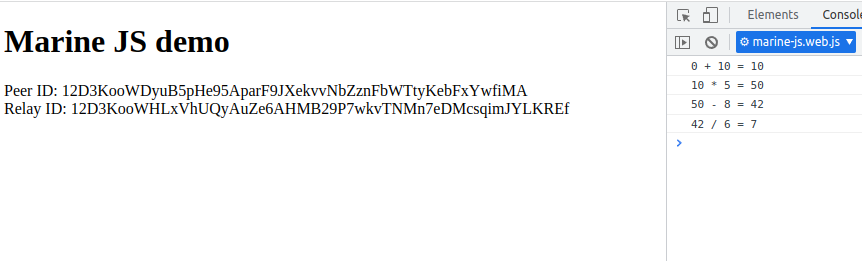

# Marine JS demo

Marine JS allows to run marine wasm services on JS peers.

## Why Marine-JS?

Our goal is to make the Fluence JS peer as capable as the Fluence Rust peer. Previously there was no way to run wasm services on the JS peer. Now this feature is available and it's now easier to treat both types of peers as the same.

If you want to run services both on Rust and JS peers, this feature will surely help you. Marine-JS unlocks the ability to make mind-blowing things with aqua and deploy services dynamically on any type of peers (edited)

## Build Marine service

To build marine service:

```bash
cd service
./build.sh
```

Two files will be generated inside `artifacts` directory.

- calc_service.wasm - the wasm service
- calc_service.aqua - aqua definitions for the service

The project contains deployment config file as well as the script to deploy service to Fluence network.

To do so:

```bash
cd service
./deploy.sh
```

Service ID will be printed to console:

```
Going to upload a module...
2022.04.26 02:28:59 [INFO] created ipfs client to /ip4/46.101.159.139/tcp/5001
2022.04.26 02:28:59 [INFO] connected to ipfs
2022.04.26 02:28:59 [INFO] file uploaded
Now time to make a blueprint...
Blueprint id:
76da3bad81924c5c49b974b365ad816534db8858947467dbf25d1ce2f7dd2c0b
And your service id is:
"3de40f52-2754-4f94-b87a-2d94a57d647d"
```

To try newly deployed service execute in repo root:

```bash
./run_on_rust_node.sh 3de40f52-2754-4f94-b87a-2d94a57d647d
```

## Host marine service inside JS peer

To build and run nodejs example:

```bash
cd node
npm i
npm start
```

The application will start. Peer Id and Relay Id will be printed to console:

```
application started
peer id is:  12D3KooWH71ZkJatk73EfviugJiQ1hGFWCTFDWdsZVgX4JrYZYGm
relay is:  12D3KooWFEwNWcHqi9rtsmDhsYcDbRUCDXH84RC4FW6UfsFWaoHi
press any key to quit...
```

To build and run web example:

```bash
cd web
npm i
npm start
```

The browser window will open. Peer and and Relay Id will be shown in the page:



You can run the demo calculation with the script in repo root. You need to pass the peer id and relay as arguments:

```bash
run_on_js_peer.sh 12D3KooWH71ZkJatk73EfviugJiQ1hGFWCTFDWdsZVgX4JrYZYGm 12D3KooWFEwNWcHqi9rtsmDhsYcDbRUCDXH84RC4FW6UfsFWaoHi
```

Note that the logs from marine service are printed to the console:

```
[marine service "calc"]: 0 + 10 = 10
[marine service "calc"]: 10 * 5 = 50
[marine service "calc"]: 50 - 8 = 42
[marine service "calc"]: 42 / 6 = 7
```
